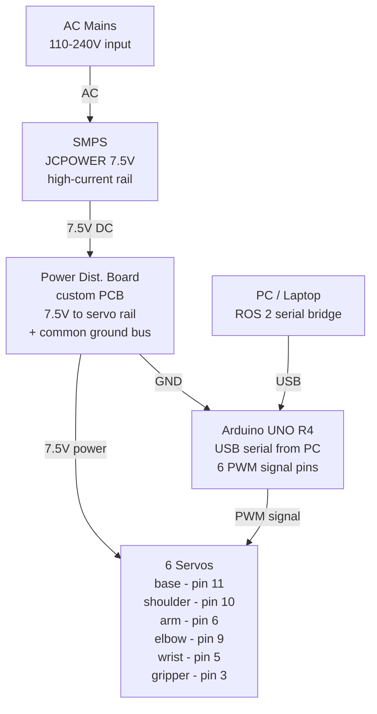

# Robot Chess Isaacsim Learm Hiwonder

Control code for a 6-DOF Hiwonder/LeArm robotic arm: an Arduino sketch that drives
the servos, and a Python script that lets you drive it live with an Xbox controller.

## Contents

- [`Ardunio_Control_Learm/Ardunio_Control_Learm.ino`](Ardunio_Control_Learm/Ardunio_Control_Learm.ino) —
  Arduino sketch that reads target servo angles over serial and smoothly moves
  the arm's 6 servos (base, shoulder, arm, wrist, elbow, gripper) toward them.
- [`Python_Control_Learm/xbox_controller_arm_control.py`](Python_Control_Learm/xbox_controller_arm_control.py) —
  Python script that reads an Xbox controller with `pygame` and streams servo
  positions to the Arduino over serial.
- [`Python_Control_Learm/requirements.txt`](Python_Control_Learm/requirements.txt) —
  Python dependencies (`pyserial`, `pygame`).
- [`Mujoco_Chess_Sim_Learm/`](Mujoco_Chess_Sim_Learm/) —
  MuJoCo simulation of the LeArm (URDF from
  [andrewda/learm_ros2](https://github.com/andrewda/learm_ros2)) at a chess
  board on a table, plus the 2-corner board-calibration approximation method.
  Pure simulation — see that folder's README for whether/how it connects to
  the real hardware above.

## Hardware wiring

| Servo    | Arduino Pin |
|----------|-------------|
| Base     | 11          |
| Shoulder | 10          |
| Arm      | 6           |
| Wrist    | 5           |
| Elbow    | 9           |
| Gripper  | 3           |

## Power & control circuit



**Critical wiring rules**

1. Servo POWER comes from the SMPS rail — never from Arduino 5V (it cannot supply several amps).
2. Arduino and SMPS grounds MUST be tied together (common ground) or PWM signals float and servos jitter.
3. Add a large capacitor (1000µF+) across the servo rail to absorb current spikes during fast moves.

## Serial protocol

The Arduino listens on serial at `115200` baud for newline-terminated, comma-separated
target angles in the order `base,shoulder,arm,wrist,elbow,gripper`, e.g.:

```
90,90,90,90,90,90
```

Each value is clamped to that servo's configured limits and the arm eases toward
the target at 1°/15ms per joint, instead of snapping instantly.

## Running the Arduino sketch

1. Open `Ardunio_Control_Learm/Code_for_movingarm_in_ardunio.ino` in the Arduino IDE.
2. Select your board (this targets an ATmega328P-based board, e.g. Uno/Nano) and port.
3. Upload.

## Running the Xbox controller script

1. Install dependencies:
   ```
   pip install -r Python_Control_Learm/requirements.txt
   ```
2. Plug in an Xbox controller and connect the Arduino over USB.
3. Edit `COM_PORT` in `xbox_controller_arm_control.py` to match your serial port
   (e.g. `COM4` on Windows, or `/dev/tty.usbmodemXXXX` on macOS).
4. Run:
   ```
   python Python_Control_Learm/xbox_controller_arm_control.py
   ```

### Controls

- Left stick X/Y — base / shoulder
- Right stick X/Y — wrist / arm
- LT / RT — elbow
- X / B — open / close gripper
- Y — return to home position
- Back — quit
